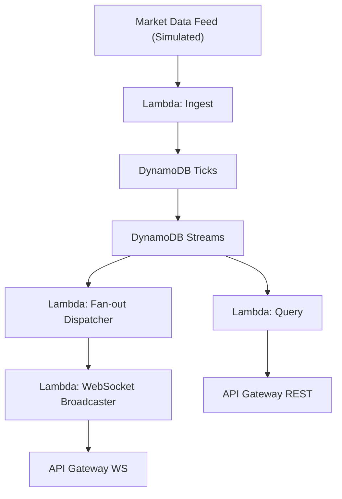

# Real-Time Market Data Pipeline

> 🚀 **Live infrastructure. Real AWS deployment. Not a toy repo.**

This project is my first production-grade backend — an open-source, serverless **real-time market data pipeline** built to run at scale under extreme constraints:

- ⚙️ Deployed with **AWS CDK (TypeScript)** using Lambda, DynamoDB, and API Gateway  
- 💸 Designed for **1M+ req/month at sub-$10/month** infra cost  
- 🔁 Currently running with **simulated tick data ingestion + DynamoDB storage**

I'm building it in public. No fluff. No "learning project" disclaimers.  
If you're into high-throughput infra, AWS-native ops, and real observability — this is for you.

## 🚀 Project Overview

A **serverless, production-grade pipeline** designed for **real-time market data** (stocks, crypto, FX) delivering:

- ⚡ **Sub-150ms p95 latency** at scale (≥1M requests/month)  
- 💸 **Ultra-low infrastructure cost** (< $10/month)  
- 🔧 **Fully automated CI/CD pipeline** with zero manual ops  
- 🔍 **Deep observability** using CloudWatch, X-Ray, and Grafana  
- 🌐 **REST & WebSocket APIs** powered by AWS CDK (TypeScript)  

This project is **not just a demo** — it simulates a **high-throughput, resilient, and cost-effective financial data infrastructure** under real-world constraints.

---

## ❓ Why This Matters

Building trading systems, analytics dashboards, or real-time APIs? This project proves:

- ✅ Serverless architectures *can* achieve sub-200ms latencies  
- ✅ Costs don’t have to increase linearly with traffic  
- ✅ AWS native tools fully support real operational workloads  

---

## 📊 Current Status (Simulated Data)

| Metric          | Target             | Current   |
|-----------------|--------------------|-----------|
| API Latency     | p95 < 150ms        | 🟡 TBD    |
| Cost per 1k req | < $0.05            | 🟡 TBD    |
| GitHub Stars    | 500+               | 🟡 0      |
| API Keys        | 500+               | 🟡 0      |
| Uptime (30d)    | ≥ 99.95%           | 🟡 TBD    |

---

## 🗺️ Roadmap (Updated Apr 24)

- ✅ **Apr 18** – Repo scaffolded, CDK deployed  
- ✅ **Apr 24** – Ingest Lambda & DynamoDB simulation complete  
- 🔜 **May 5** – Generate and validate simulated tick data  
- 🔜 **May 19** – CI/CD pipeline running; unit test coverage ≥30%  
- 🔜 **Jun 9** – REST API endpoint live (dev environment)  
- 🔜 **Jun 23** – WebSocket API live + Real-time dashboard (Next.js)  
- 🔜 **Jul 14** – Load test (500 RPS sustained) complete  
- 🔜 **Aug 4** – Full-scale test (1,000 RPS / p95 <150ms) documented  
- 🔜 **Aug 18** – Public beta available  
- 🔜 **Sep 1** – Official "Show HN" launch (500 stars target)  

---

## 🧱 Architecture Overview

**Key components explained:**

- **Market Data Feed:** Simulated tick data generator feeding ingestion  
- **Lambda: Ingest:** Processes incoming ticks, writes to DynamoDB  
- **DynamoDB:** Stores tick data with streams enabled for fan-out  
- **Lambda: Query:** Serves REST API queries efficiently  
- **Lambda: Fan-out Dispatcher:** Listens to DynamoDB Streams to push updates  
- **Lambda: WebSocket Broadcaster:** Sends real-time updates to connected clients via WebSocket API Gateway  

This architecture ensures **low-latency, scalable, and cost-effective** real-time data delivery.

---

## 🎯 Project Goals

- ⏱️ Achieve **sub-150ms latency** at p95  
- 💸 Maintain **infrastructure cost <$10/month** at 1M+ requests  
- 💥 Implement **100% CI/CD** with zero manual infra operations  
- 🧠 Showcase **observability, resilience, and scale** with AWS native tools  

---

## 📦 Technology Stack

- **AWS Services:** Lambda, DynamoDB, API Gateway, SQS, CloudWatch, X-Ray, WAF  
- **Infrastructure as Code:** AWS CDK (TypeScript)  
- **Observability:** CloudWatch, Grafana, AWS X-Ray  
- **CI/CD:** AWS CodeCatalyst, Jest, Artillery  
- **Frontend (coming soon):** Next.js Real-time Dashboard (WebSocket)  

---

## 🚧 Immediate Next Steps (Updated Apr 24)

- ✅ **Apr 24** – Ingest Lambda & DynamoDB simulation completed successfully 🎉  
- 🔜 **May 5** – Generate and validate simulated tick data to ensure data quality  
- 🔜 **May 12** – Launch first local REST API query endpoint for ingestion validation  
- 🔜 **May 19** – Develop initial Jest tests aiming for >10% coverage  
- 🔜 **May 26** – Set up AWS CodeCatalyst for automated CI/CD pipeline  
- 🔜 **Jun 2** – Begin integrating observability tools (CloudWatch, X-Ray, Grafana)  

Focus is on **building robust data generation and query capabilities**, **establishing automated testing**, and **streamlining deployment workflows** to maintain high visibility on progress.

---

## 📎 License

MIT — free to use, modify, and deploy. Contributions welcome.
